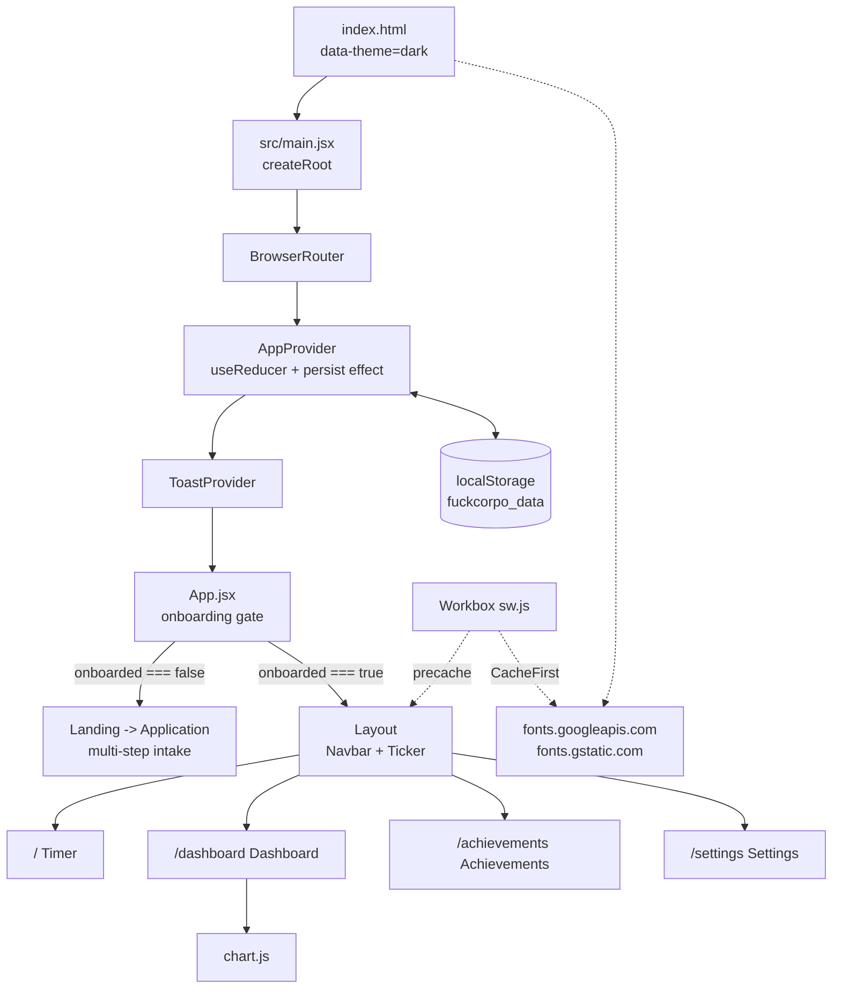
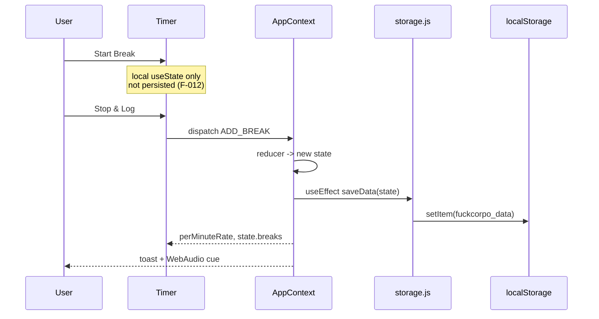

# Architecture and Implementation

Analysis date: 2026-07-28. Repository: `C:\Users\Ziggy\Dropbox\GitHub\fuck_corpo`.

---

## 1. System shape

FuckCorpo is a single-page React application with no server component. There is no API, no database, no queue, no authentication, and no third-party service integration beyond a webfont CDN. All state lives in the browser under one `localStorage` key. This is the entire deployed surface.

| Layer | Technology | Notes |
|---|---|---|
| Runtime | React 19.2 | Function components, hooks only |
| Build | Vite 7.2 with `@vitejs/plugin-react` 5 | ESM, single entry |
| Routing | `react-router-dom` 7.13 | Declarative `<Routes>` form, four routes |
| State | `useReducer` in a context provider | Eight actions, one store |
| Persistence | `localStorage`, key `fuckcorpo_data` | JSON, unversioned |
| Charts | Chart.js 4.5 via `react-chartjs-2` 5.3 | Line, Bar, Doughnut |
| Icons | `lucide-react` 0.563 | |
| Offline | `vite-plugin-pwa` 1.2, Workbox `generateSW` | Precache 8 entries, 510.89 KiB |
| Styling | Plain CSS, co-located per component | CSS custom properties, `data-theme` switch |
| Types | None | `@types/*` installed, no compiler |
| Tests | None | |



### Store

```
{
  salary:       { amount, type, currency },
  breaks:       [ { id, category, duration, timestamp } ],
  settings:     { theme, currency, timezone, industry, state, soundEnabled },
  achievements: [ string ],
  onboarded:    boolean
}
```

Actions: `SET_SALARY`, `ADD_BREAK`, `DELETE_BREAK`, `UPDATE_SETTINGS`, `ADD_ACHIEVEMENT`, `SET_ONBOARDED`, `IMPORT_DATA`, `RESET`. The last two are never dispatched (F-008).

---

## 2. Data flow



Every state change triggers a full serialise-and-write of the entire store. At current data volumes that is inexpensive. It becomes a consideration at a few thousand break records, where each keystroke-adjacent dispatch rewrites the whole array.

The only inbound external data is the import file, which is unvalidated (F-007).

---

## 3. Third-party inventory

| Service | Data disclosed | Trigger | Notes |
|---|---|---|---|
| `fonts.googleapis.com` | IP address, user agent, referrer | Every page load | Contradicts the README "no tracking" claim; GDPR-relevant. See F-013 |
| `fonts.gstatic.com` | Same | Font file fetch | Runtime-cached by Workbox for one year |

No analytics, no error reporting, no backend, no advertising, no session or credential handling. The absence of error reporting is itself a finding (F-014): failures in a service-worker-backed PWA are invisible without it.

---

## 4. Walkthrough by feature

### 4.1 Onboarding

`App.jsx:13` gates on `state.onboarded`. When false, `Landing` renders instead of the router outlet, so the onboarding screen has no URL of its own and is not linkable or back-navigable. `Application.jsx` runs a multi-step satirical intake and commits three dispatches at `Application.jsx:121-123`. Validation is `!salary || Number(salary) <= 0` and nothing more. The only lint error with runtime cost lives here (`Application.jsx:83`, F-010).

### 4.2 Timer

`Timer.jsx` is the primary surface. A `setInterval` at 100 ms recomputes elapsed from `Date.now() - startTimeRef.current`, so the display is accurate even if the interval is throttled, but none of it survives unmount (F-012). Breaks under one second are dropped without feedback. Quick Log accepts a date and pins it to local noon (`Timer.jsx:105`), a reasonable choice that avoids DST edge cases. Break IDs use `crypto.randomUUID()`, which is correct and requires a secure context.

### 4.3 Dashboard

Heavy but well-structured. Twelve `useMemo` blocks derive today, week, month, year, and lifetime totals plus three chart datasets. The memo dependency arrays are correct. An empty state short-circuits at `Dashboard.jsx:173` before any chart config is built. Two defects live here: the category colour map keys do not match what the Timer writes (F-006), and every `formatCurrency` call omits the currency (F-003). Chart.js is imported eagerly into the initial bundle even though it is used on one route (F-015).

### 4.4 Achievements

Eleven achievements evaluated in a single effect (`Achievements.jsx:39-50`). Unlock is idempotent: the reducer deduplicates at `AppContext.jsx:24`, and a `toastedRef` seeded from already-unlocked IDs prevents re-toasting on mount. The effect depends on `addToast` and `achievementSound`, both stable `useCallback` values, so it does not loop. This is one of the more carefully built parts of the codebase. Note that achievement thresholds are absolute dollar values (`$100 Club`) evaluated against a USD-assumed figure, which interacts with F-003.

### 4.5 Settings

Holds six pieces of local form state mirroring the store, committed on submit. Two data flows bypass the reducer entirely in favour of `window.location.reload()` (F-008). The theme write here is the only writer of `data-theme` and is not reapplied at boot (F-005).

### 4.6 Shared kit and PWA

`Button`, `Card`, `Toast`, `PageTransition`, `AnimatedCurrency` plus `useCountUp` and `useSound`. `useSound` synthesises tones with the WebAudio API rather than shipping audio files, correctly gating on `settings.soundEnabled` and handling suspended-context resume. The PWA config is otherwise sound but references three icon files that do not exist (F-002).

---

## 5. Layering assessment

The layering is conventional and mostly clean: `pages` consume `context` and `utils`, `components/shared` are presentational, `hooks` are thin. There is no god object, no circular dependency, and no legacy module.

The recurring weakness is that domain knowledge which belongs to the store has been placed in module-level constants beside its consumers instead. Category metadata is split across `Timer.jsx`, `Dashboard.jsx`, and `calculations.js`. Currency lives in the store but the formatter that needs it is a bare function with a USD default. Reset semantics exist in the reducer but the UI implements its own version with a page reload. Each of these is individually small; together they describe a codebase where the store is the nominal source of truth but not the enforced one. See the Design & Abstraction summary in `findings.md`.

Logging: one `console.error` at `storage.js:32`. No debug logging left in production paths and no sensitive data logged.

---

## 6. Build and CI posture

| Check | Result |
|---|---|
| `npm ci` | exit 0, 444 packages, ~9s |
| `npm run lint` | **exit 1**, 5 errors, 1 warning |
| `npm run build` | exit 0, 1757 modules, 1.99s |
| `npm test` | **no script** |
| `npm audit` | **exit 1**, 19 vulnerabilities (14 high) |
| CI workflows | **none** (`.github/` absent) |
| Branch protection | none observed |
| Deploy config | none (no `vercel.json`, no Dockerfile, no IaC) |

No infrastructure-as-code, containers, or cloud configuration exist in this repository, so no IaC review was applicable. Deployment target is undeclared. As a client-only SPA it can be served from any static host, but nothing in the repository records where or how.

---

## 7. Platform verification plan

What was verified in this audit, and what a follow-up should cover.

### Completed (VERIFIED)

- Clean install from lockfile on Node 25.9.0
- Production build succeeds; bundle sizes and precache manifest captured
- Lint executed; all rule violations enumerated with locations
- Dependency vulnerability scan against the installed tree
- Full git history, contributor, and hygiene review
- Secret scan across all commits and the working tree, zero true positives

### Not performed (VERIFICATION-GAP)

| Gap | Why it matters | How to close |
|---|---|---|
| No browser execution of any user flow | Nine of eleven defects in `bugs.md` are STATIC-ONLY | `npm run preview`, then walk onboarding, timer, dashboard, achievements, settings |
| PWA installability not tested against a live browser | F-002 is inferred from a file listing plus the emitted manifest | Chrome DevTools, Application, Manifest; then Lighthouse PWA audit |
| Offline behaviour untested | Service worker precache and font runtime caching unexercised | Load, go offline in DevTools, reload, exercise all four routes |
| Cross-browser and mobile-viewport testing | Spec targets 320px upward and mobile-first | Test at 320, 768, 1024, 1440 in Chrome, Safari, Firefox |
| Accessibility | Spec targets WCAG AAA; nothing checks it | axe DevTools per route; add `eslint-plugin-jsx-a11y` |
| `npm outdated` | Major-version drift not enumerated | Run from repo root |
| `git count-objects -vH` and blob listing | Repo size unmeasured; shell permission denied | Re-run with permission granted |
| gitleaks full ruleset | Secret verdict rests on pattern grep, not entropy analysis | Install gitleaks and re-run |

---
generated_by: codebase-audit skill v1.1
generated_on: 2026-07-28
project: C:\Users\Ziggy\Dropbox\GitHub\fuck_corpo
project_type: node
verification: full
---
